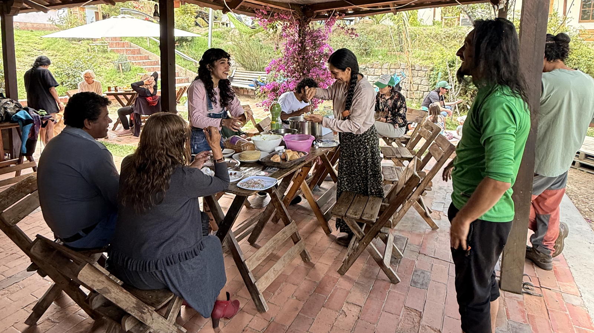

[Voluntariado Barranco](../) >

# Apthapi del Voluntariado Barranco 🍲

_Actividad del Voluntariado Barranco_

> Verdecito lo que salga.
> Algo en ti ya sabe brotar.
> Aquí solo lo recordamos.

---

## Meta

- **Versión:** v1.0.0
- **Estado:** activo (Febrero: sábado 28; para próximas fechas habrá votación en el grupo)
- **Responsable(s):** Ernesto (punto de contacto) + voluntarios del día
- **Tarea del mes (Febrero):** inventario de los productos de la barra reducida (consumo/venta)

## Links

- [Grupo de WhatsApp — Voluntariado Barranco](https://chat.whatsapp.com/LUlxChjwX6qIcdwRdaCGbm)
- [Ubicación (Google Maps) — Proyecto Cultural Barranco](https://goo.gl/maps/iWB6R5HZnREL7ALKA)

---

## 0) Lo esencial (en 5 líneas)

Nos reunimos (idealmente un sábado al mes) para compartir un **apthapi** y cuidar el Barranco con manos ligeras y corazón presente.

- **Yoga previo es opcional:** puedes venir solo a comer, solo a ayudar, o solo a compartir.
- Co‑creamos entre todos, con conciencia, bondad y sentido común.
- Cerramos el bloque comunitario a las **2:00pm**.
- Dejamos el lugar listo para abrir al público y también disfrutamos el espacio.
- **Febrero:** sábado **28**. Para próximas fechas habrá votación en el grupo.

---

## 1) Qué es

Un encuentro del Voluntariado Barranco para compartir comida, conocer a otros voluntarios, conversar ideas y hacer tareas ligeras pero constantes que ayudan al Proyecto Cultural Barranco a operar mejor.

Un **apthapi** es una comida comunitaria de la tradición andina: cada quien trae algo para compartir y armamos una mesa común. No se trata de “traer perfecto”, sino de traer con cariño — y de compartir.

Es simple y adoptable: funciona con 5 personas y también con 30. Si una vez somos pocos, se hace igual. Verdecito lo que salga.

---

## 2) Cuándo y dónde

- **Frecuencia:** inicialmente 1 sábado al mes (para próximas fechas habrá votación en el grupo)
- **Rango horario base:**
  - **11:30am** — llegada (post‑yoga para quien venga)
  - **12:00pm → 2:00pm** — apthapi + conversación + tareas del bloque
  - **2:00pm → 4:20pm** — ventana flexible: cierre suave + dejar listo para abrir + tareas + disfrutar el lugar (puede empezar desde **3:00pm**)
- **Lugar:** Proyecto Cultural Barranco, Mallasa — Calle Las Tunas 224
- **Google Maps:** [Abrir ubicación](https://goo.gl/maps/iWB6R5HZnREL7ALKA)

---

## 3) Cómo sumarte

1. Entra al grupo del voluntariado.
2. Confirma tu asistencia cuando se anuncie la fecha (para estimar comida y tareas).
3. Llega con espíritu de “voluntario por un día”: colaboramos y disfrutamos.

---

## 4) Antes y después (cómo colaboramos)

**Durante el bloque (12:00 → 2:00):**
- apthapi (comida compartida)
- conversación y aterrizaje de ideas
- tareas rápidas (ver sección 5)

**Después del cierre (2:00 → 4:20):**
- dejamos el espacio listo para abrir al público
- hacemos tareas adicionales según disponibilidad de voluntarios (jardín, orden fino, etc.)
- disfrutamos el lugar (hamacas, slackline, sol, música)

---

## 5) Roles y tareas típicas

Regla: horizontal, pero con roles claros cuando hace falta.

**Tareas fijas (casi siempre):**
- vaciar basureros
- barrer
- lavar platos/vasos
- inventario de barra reducida (en Febrero: tarea principal del apthapi)

**Tareas opcionales (según energía):**
- jardín (orden, riego, poda ligera)
- orden general (mesas, sillas, toldos)
- pequeñas mejoras y mantenimiento suave

**Recursos disponibles:**
- tenemos bolsas, cartones y lo necesario para limpieza

---

## 6) Comida: cómo funciona

**Apthapi:** cada quien trae algo para compartir (o se suma con lo que pueda).

**Parrilla abierta:** si decidimos encender la parrilla (y hay un voluntario responsable), puedes traer tu apthapi para meter a la parrilla.

**Ocasionalmente:** alguien puede ofrecer cocinar para quienes confirmen en el grupo, con un aporte sugerido (se define caso por caso).

---

## 7) Qué traer (recomendado)

- tu plato, vaso y cubiertos
- tu tomatodo (hay agua para recargar)
- (opcional) algo para compartir en el apthapi

---

## 8) Notas útiles (aprendido en Año Nuevo)

- Funciona perfecto con pocos: el tamaño del grupo se ajusta orgánicamente.
- Cambiar de chip ayuda: no “servicio”, sino co‑creación (cada quien se atiende y también aporta).
- Claridad con roles evita fricción: un responsable por tarea clave (aunque sea rotativo) hace que todo fluya.

## 9) Notas y cambios

**Notas:**
- Después de las **4:20pm** el Barranco entra en su programación habitual. Quedan invitados a quedarse quienes gusten.
- Uno es libre de llegar e irse cuando quiera. Lo importante es sostener el acuerdo: cuidado, bondad y responsabilidad.

**Changelog:**
- **v1.0.0** — Primera versión del documento de actividad.

---

## Documento siempre actualizado
https://github.com/barranco-life/Voluntariado/blob/main/Actividades/Apthapi.md
