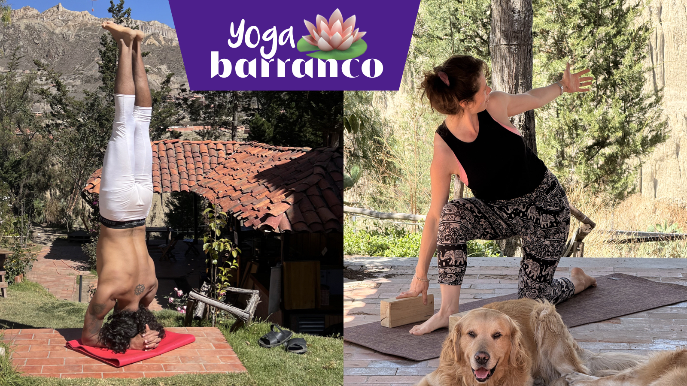

[Voluntariado Barranco](../) >

# Yoga Barranco 🪷 con Krishna

_Actividad del Voluntariado Barranco_

> Verdecito lo que salga.
> Algo en ti ya sabe brotar.
> Aquí solo lo recordamos.

---

## Meta

- **Versión:** v1.2.0
- **Estado:** actividad regular semanal del voluntariado (primer modelo).
- **Responsable(s):** Krishna + Jyoti + Ernesto (punto de contacto operativo)

## Links

- [Grupo Voluntariado Barranco (WhatsApp)](https://chat.whatsapp.com/LUlxChjwX6qIcdwRdaCGbm)
- [Grupo Yoga Barranco (WhatsApp, para más info y otras clases)](https://chat.whatsapp.com/IUNZ5oQeG4a3nXEfJ33P15)
- [Ubicación (Google Maps)](https://goo.gl/maps/iWB6R5HZnREL7ALKA)
- [Documento (siempre actualizado en GitHub)](https://github.com/barranco-life/Voluntariado/blob/main/Actividades/Yoga.md)
- [Referencia histórica (canvas público)](https://chatgpt.com/canvas/shared/695c6535e67881919baa3d1c82264bb7)

---

## 0) Lo esencial (en 5 líneas)

- Yoga semanal en el **Proyecto Cultural Barranco**.
- **Krishna (Hatha Yoga – Iyengar):** martes y jueves 10:00am.
- **Jyoti (Hatha Yoga):** sábados 10:00am.
- **Aporte sugerido: 40 Bs** (según posibilidades). **10 Bs** van a la **caja del voluntariado**.
- Barra reducida disponible: consumir apoya al Barranco.
- Se sostiene en modo comunidad: preparamos y dejamos el lugar impecable entre todos.

---

## 1) Qué es

Yoga Barranco es una práctica compartida: se llega, se ayuda un poco, se practica, y se deja todo en orden.

Dentro del voluntariado, hoy sostenemos dos clases: Krishna (Hatha Yoga – Iyengar) y Jyoti (Hatha Yoga). Dos estilos, una misma base: cuidado, presencia y comunidad.

---

## 2) Cuándo y dónde

- **Días:** martes y jueves (Krishna) + sábado (Jyoti)
- **Hora:** 10:00am
- **Lugar:** Proyecto Cultural Barranco, Mallasa — Calle Las Tunas 224
- **Google Maps:** [ver ubicación](https://goo.gl/maps/iWB6R5HZnREL7ALKA)

> Nota: sábados y domingos también hay otras clases además de Jyoti. Para más info: [grupo de Yoga Barranco](https://chat.whatsapp.com/IUNZ5oQeG4a3nXEfJ33P15).

---

## 3) Cómo sumarte

1. Llega unos minutos antes para acomodarte y ayudar con una o dos tareas simples.
2. Aporta lo que puedas (sugerido 40 Bs; de eso 10 Bs van a la caja del voluntariado).
3. Si quieres enterarte de más actividades del voluntariado: entra al grupo y preséntate.

---

## 4) Antes y después (cómo colaboramos)

**Antes (2–4 tareas):**
- barrer/ordenar un poco el área
- sacar bloques y acomodar el ambiente
- ayudar con la sombrilla si hace falta

**Después (2–4 tareas):**
- guardar bloques y dejar el espacio limpio
- recoger lo usado y dejar todo listo para el siguiente uso

---

## 5) Roles (si aplica)

- **Facilitación de la clase:** Krishna (Iyengar) / Jyoti (Hatha)
- **Punto de contacto / operación del día:** Ernesto (y Krishna/Jyoti según el día)
- **Barra reducida:** Ernesto (y Krishna/Jyoti según disponibilidad)

---

## 6) Aportes, barra y transparencia (si aplica)

- **Modalidad:** aporte sugerido.
- **Aporte sugerido:** 40 Bs (según posibilidades).
- **Caja del voluntariado:** 10 Bs por persona.
- **Objetivo actual de la caja:** juntar para pagar al **jardinero** del Barranco (200 Bs) de manera regular. Un jardín bien cuidado atrae más alumnos y crea un círculo virtuoso.

**Barra reducida (apoyo al Barranco):** helados, kombuchas y poco más.
- Se invita a apoyar consumiendo en barra: ayuda a cubrir costos de mantenimiento y operación del Barranco.
- En esta actividad, el porcentaje de barra que normalmente correspondería al instructor/voluntariado se cede al Barranco como reciprocidad por el uso del espacio.

**Inventario / consolidación:**
- Se hace **inventario semanal** del bloque reducido los **sábados después del yoga**, antes de que el Barranco abra a las 4:20pm.
- Responsables: **Ernesto** + participación de **Krishna** y/o **Jyoti**.

---

## 7) Qué traer (opcional)

- Mat propio (si tienes). Hay tapetes y bloques disponibles, pero mejor traer el tuyo.
- Agua (tomatodo).
- Ropa cómoda.

---

## 8) Notas y cambios

**Changelog:**
- **v1.2.0** — Se integra la clase de Jyoti (Hatha Yoga) de los sábados 10am; el aporte sugerido y aporte a caja se unifican para ambas clases.
- **v1.1.0** — Reorganización al template (secciones 0–8) y links canónicos: GitHub como fuente de verdad; canvas como referencia histórica.
- **v1.0.0** — Documento inicial de actividad (runbook).

https://github.com/barranco-life/Voluntariado/blob/main/Actividades/Yoga.md
