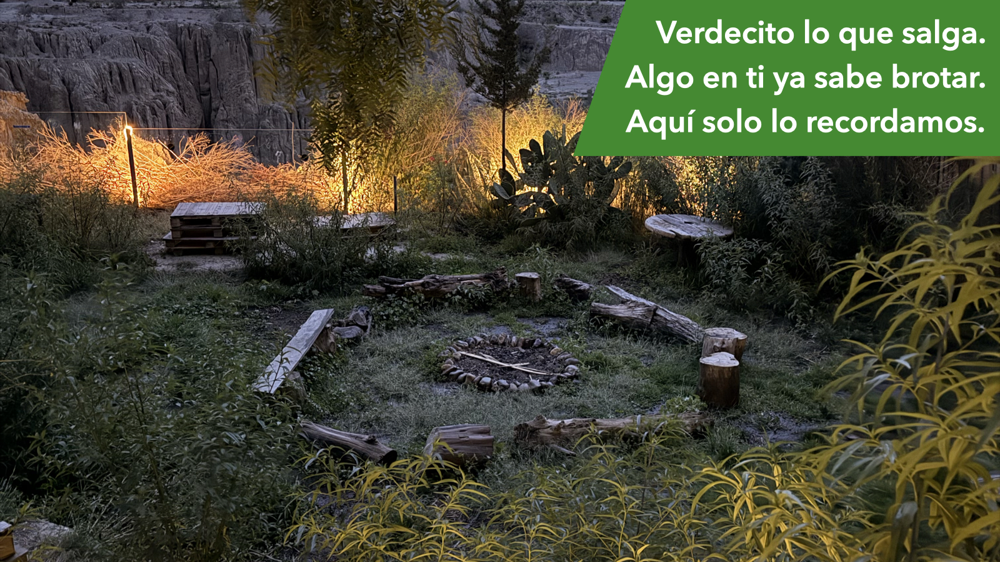

# Voluntariado Barranco

El Voluntariado Barranco es una comunidad abierta y [replicable en otros espacios](https://github.com/barranco-life/Voluntariado/fork): un conjunto de actividades auto‑gestionadas dentro del Proyecto Cultural Barranco (Mallasa, La Paz). La idea es simple: alguien propone, [se le da forma](./Actividades/Nueva_Actividad.md), otros se suman, y entre todos hacemos que una actividad suceda cuidando el lugar y dejando todo **igual o mejor** — en un espíritu de beneficio mutuo.

Si te interesa vivir y construir una forma distinta de comunidad — práctica, humana, en armonía con la naturaleza y los animales, hacia adentro y sin excusas externas — esto es para ti. Si esta visión te resuena, puedes leerla en detalle [aquí](./VISION.md).

Para participar entra al [grupo de WhatsApp](https://chat.whatsapp.com/LUlxChjwX6qIcdwRdaCGbm), preséntate, y súmate a una actividad o [propón una nueva](#proponer-una-actividad)!

## Actividades

Las actividades son la razón de ser del voluntariado: son nuestra “moneda”. Cada actividad es una oportunidad para encontrarnos, cuidar el Barranco, aprender, celebrar la vida y demostrar que la autogestión sí puede funcionar con alegría y responsabilidad.

### En curso

**Yoga Barranco 🪷 con Krishna**

Clases regulares de Hatha Yoga - Iyengar (martes y jueves 10am): preparación simple del espacio + aporte sugerido + apoyo al Proyecto Cultural Barranco y a la caja del voluntariado. [Más info](./Actividades/Yoga.md)

**Apthapi del Voluntariado Barranco**

Encuentro mensual después del yoga (sábado desde las 11:30am) para compartir, cocinar/comer tipo apthapi y dejar el espacio listo para la apertura habitual del Barranco. A veces también se suman trabajos puntuales (jardín, ordenar, arreglar algo, etc.). [Más info](./Actividades/Apthapi.md)

### Pasadas

**Año Nuevo en el Barranco: Voluntariado por un día**

**Primer piloto oficial** del voluntariado: celebramos Año Nuevo como comunidad (sin dinámica de “clientes/empleados”), con acuerdos de convivencia, apthapis, roles livianos y un reporte transparente del experimento. [Más info](./Actividades/Año_Nuevo.md)

### Más ideas

Estas ideas están aquí para inspirar: se pueden activar en cualquier momento si aparece un grupo que las sostenga.

**Cine al aire libre**

Una noche simple: quienes sostienen la actividad eligen una película, montan proyector/pantalla y disfrutan.

**Celebraciones (cumpleaños, aniversarios, etc.)**

Celebraciones en comunidad, con acuerdos claros y espíritu de cuidado. Casi siempre incluye un [apthapi](./Actividades/Apthapi.md).

**Grupos de estudio (textos hindúes y otros)**

Círculos de lectura y conversación (por ejemplo Mahabharata / Bhagavad Gita, y luego otros textos). Sostenidos por quien proponga y por quienes se sumen.

**Jornadas de jardinería**

Un bloque de cuidado del jardín para mantenerlo vivo y hermoso (limpieza, poda ligera, riego, compost, etc.). Puede ser mensual o cuando haga falta. Lo importante es hacerlo amable, disfrutable y sostenible. Especialmente útil en época seca (abril a noviembre).

## Proponer una actividad

Si tienes una idea, envíala aunque sea cruda. El voluntariado existe para que esas ideas se vuelvan realidad, orgánicamente.

Próximamente podrás proponer actividades con un formulario. Mientras tanto, si quieres ver cómo documentamos las actividades en curso (y proponer una con el mismo formato), usa el template de [Nueva Actividad](./Actividades/Nueva_Actividad.md) (incluye un prompt para generar el documento con tu IA favorita).

## Proyecto Cultural Barranco

- [Google Maps](https://goo.gl/maps/iWB6R5HZnREL7ALKA)
- [Instagram](https://www.instagram.com/barranco.life/)
- [TikTok](https://www.tiktok.com/@barranco.life)
- [Facebook](https://facebook.com/barranco.life)
- [Twitch](http://twitch.tv/barranco_life)

---

https://github.com/barranco-life/Voluntariado/blob/main/README.md
